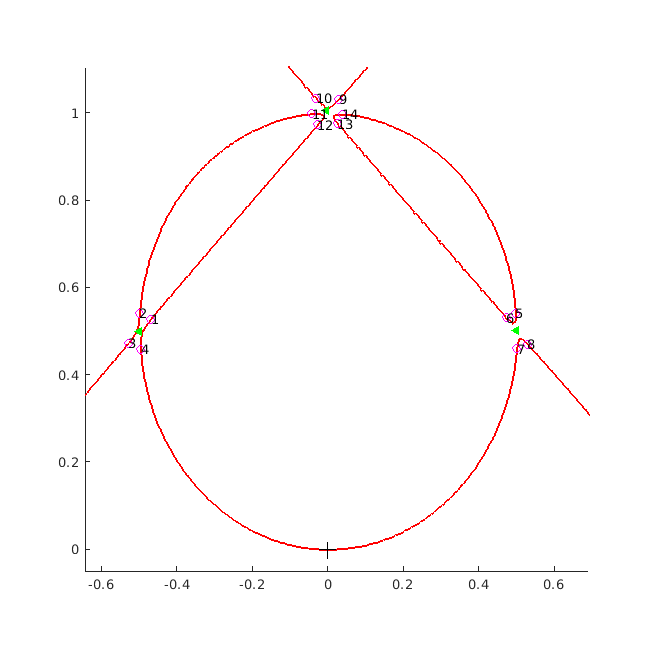
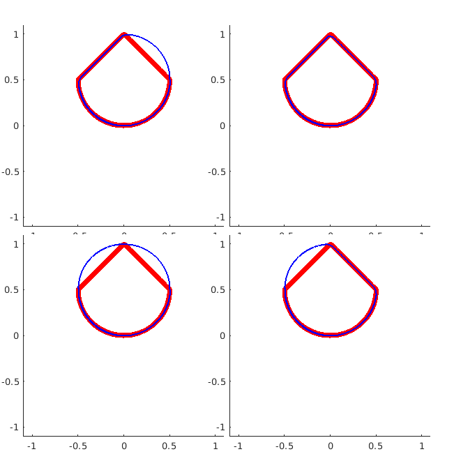
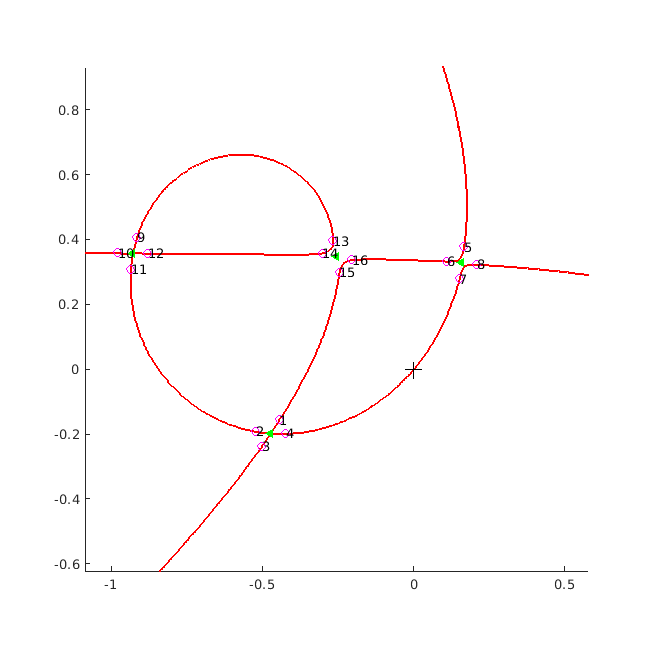
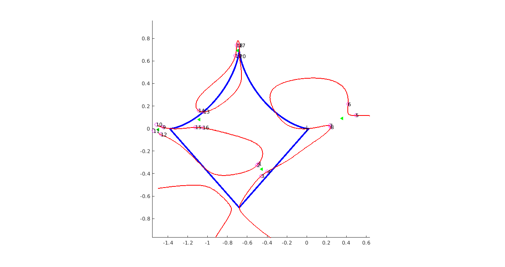

# Introduction
This project is a continuation of the paper work done in the paper:

[IDENTIFICATION OF AN ALGEBRAIC DOMAIN IN TWO DIMENSIONS FROM A FINITE NUMBER OF ITS GENERALIZED POLARIZATION TENSORS](https://hal.archives-ouvertes.fr/hal-01827232/document). 

In it we show how one can from finitely many GPTs recover a polynomial which has level set describing the original domain. Excited on by this results we created the following paper

[RECONSTRUCTION OF DOMAINS WITH ALGEBRAIC BOUNDARIES FROM GENERALIZED POLARIZATION TENSORS]() 

which aims to show both analytical and numerical the stability.

## Installation
The code is pretty much stand alone except for the following
* [SIES](https://github.com/yanncalec/SIES) only the C2 domain generation is used and is already included.
* [MatlabBGL toolbox](https://ch.mathworks.com/matlabcentral/fileexchange/10922-matlabbgl) which is too large to upload here. This tool box in necessary for the graph generation and circuit finding part of the algorithm. 
* [Sub tight ploy](https://ch.mathworks.com/matlabcentral/fileexchange/39664-subtightplot) for better visualisation, entirely optional. 

## Walk-through
The best way to see what the codes does is to walk through and example.
### Domain generation
```
nbPoints = 2000;
lambda = 0.7;
cD = shape.CompositeDoms.AddCompDom(1, nbPoints);
```
Here a domain is generated with the following information:
* C2 boundary information i.e. boundary: points, velocities, acceleration, unit normal vectors.
* The origin is contained in the boundary.
* The domain is bounded. 
* The degree of the domain is known or easily computed.

### Compute Tesselated Generalized Polarization Tensor (TGPT)
```
TGPTcD = GPT.makeTGPT(cD, lambda, cD.degree);
```

### Domain recovery 
```
rD = recoverDomain(TGPTcD);
```
Domain recovery is done on the TGPT and is contained in the above wrapper which calls the following function.
```
function rD = recoverDomain(TGPT)
    BifTol = 1e-4;
    RadInc = 0.01;
    RadIni = 0.05;
    
    rD = recDom;
    rD.coefVector = TGPT.singVecs(1,:);
    rD = rD.recPoly;
    rD = rD.recBifurPoints(BifTol);
    rD = rD.recSegPoints(RadIni, RadInc);
    rD = rD.recEdgeSet;
    rD = rD.recCircuits;
    rD = rD.recDomCandidate;
end
```
Unpacking the function:
* The parameters *BifTol*, *RadInc* and *RadIni* are tuning parameters.
* The first step is the creation of a object
* Next is to recover the coefficients of the polynomial as the singular vector of the TGPT
* Then the polynomial is generated symbolically from the coefficients.
	* From the polynomial the level set can be obtained.
* The bifurcation points are then found.
* Around bifurcation points there is searched for segmentation points to divide the level set into arcs.
* Between segmentation points the level set is traced out using the Hamiltonian of the polynomial.
* The arcs are kept and some discarded.
* The arcs are used to construct circuits.
* The circuits define domain candidates.


### Plots
```
hold on
plot(cD,'blue','Linewidth',3) %Boundary of true domain
rD.plotLevelSet               %Level set of recovered polynomial
hold off
rD.plotDomCand(cD)            %Plot the recovered domains
```
### Choosing the best candidate from those recovered
```
rD.exportDomCandidatesJPG     % Candidate domains
exportDomJPG(Dom)             % True domains
```
Export the domains as .jpg of set pixel size

```
dir = '/home/user/MatLabProjects/PADRA/Figures/Recovered Domains JPG Images/11';
domRank = getDomRank(dir);
```
Read the exported domain .jpg files as curves, compute first TGPTs and compare. **Note: file paths will have to be changed.**

### To duplicate examples in Paper
Here we show how to access the examples in the paper mentioned in the introduction as well as some further examples. The way to do this is to look in the "Figures" folder. In it the file names will contain a number i.e. *CompDomLvLSet1.png* or *CompDomRecDom1.png*.




 The examples used in the paper were:
* CompDomLvLSet3.png
* CompDomLvLSet4.png
* CompDomLvLSet5.png
* CompDomLvLSet6.png
* CompDomLvLSet11.png

There are more examples, both positive and negative, for instance:
 
 


